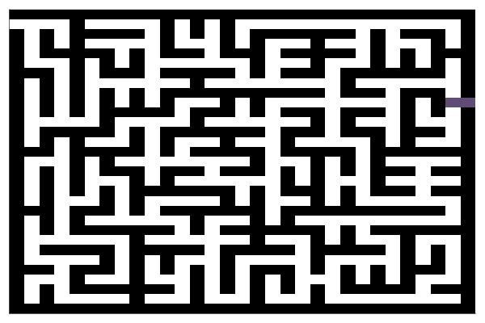

# Labyrinthe-2d-and-3d
Kruskal algorithm with Julia in 2D and 3D

# 2D Labyrinth

Generate 2D labyrinth, with steps and colors !

Then you can see the solving path 

# 3D Labyrinth

With the same algorythm, you can create a 3D labyrinthe.
With your IDE, you can handle and better see the labyrinth.

The solving path will be for soon (I hope). In all case, it's the same principle and functionning in main2d.jl : just add z axis.
Moreover, the next update will get optimization for the lasts connexions.

